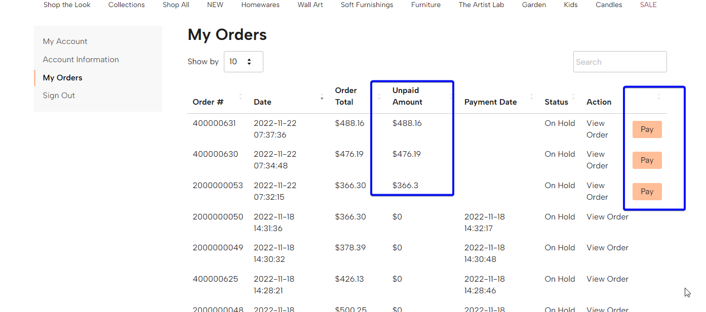
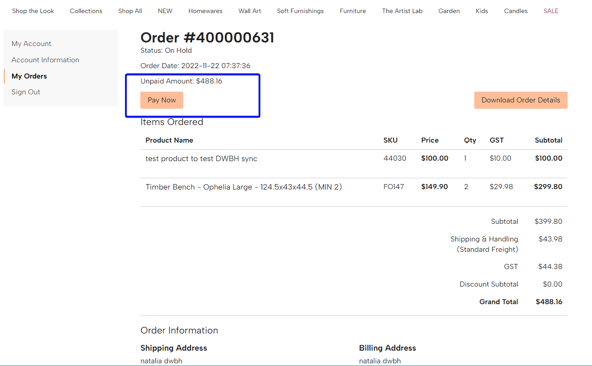
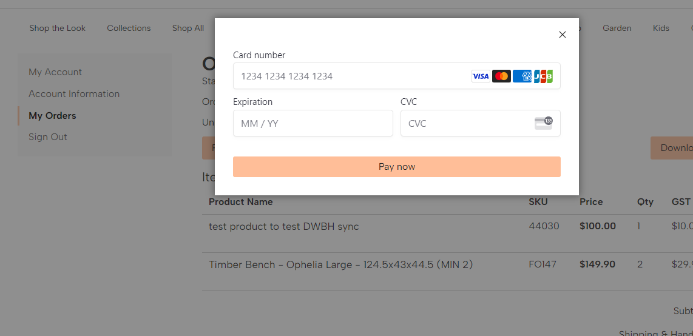

# Sekulich_MaropostOrder
This code does __not__ contain the full functionality. These are only a few files from the real module. The module is used to show and pay the unpaid amount of the order. Order data is fetch from an external system (Maropost).
JS part is removed as it was done by other developer.

## Samples
* My orders page of customer's account

* Order view page
  
* Pop up for payment

