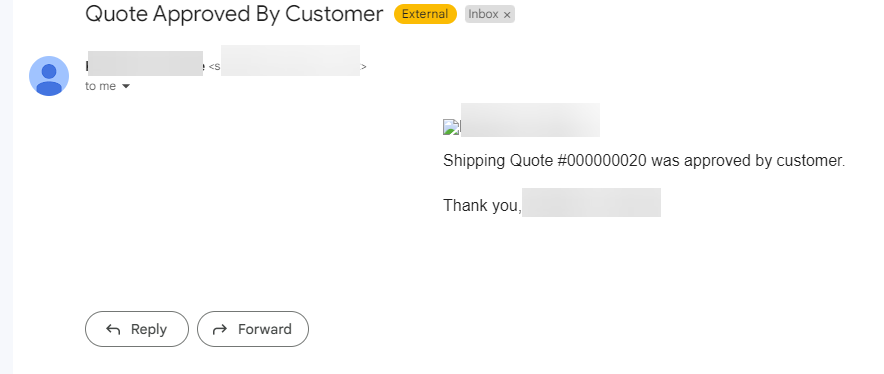
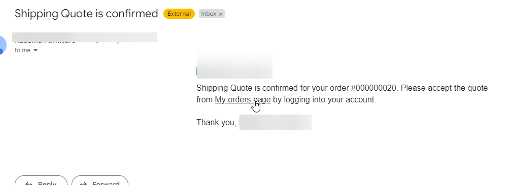
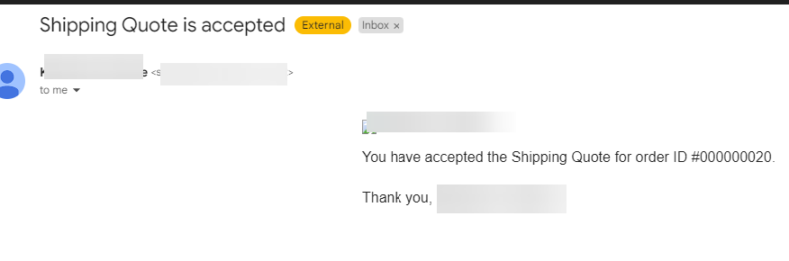
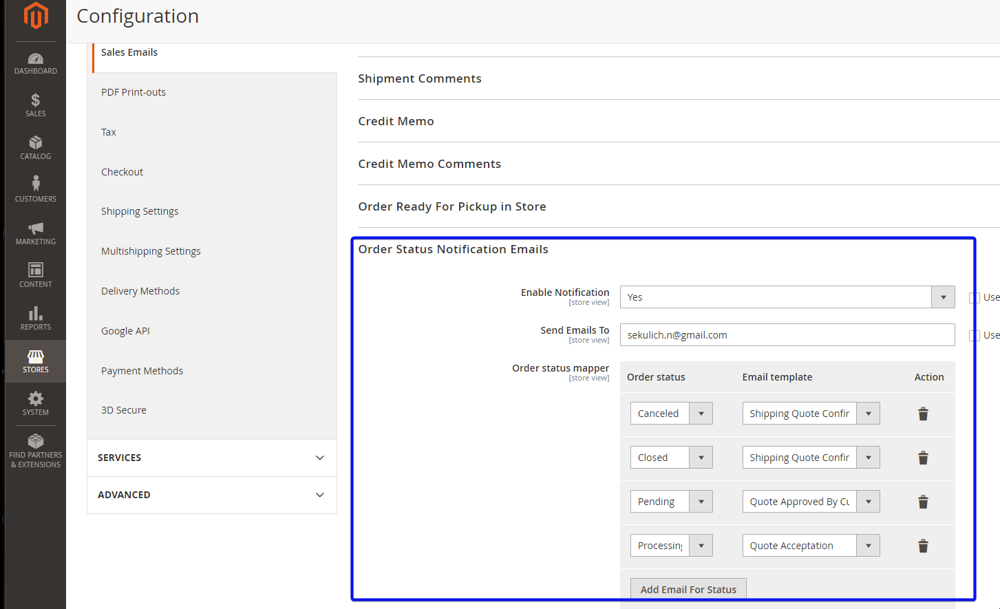

# Sekulich_OrderStatus
This is a Magento 2 module to trigger custom email sending by order status change.

## Installation
```php bin/magento s:up```

## Usage
3 email templates will be added after installations:

* Quote Approved By Customer

* Shipping Quote Confirmation
  
* Quote Acceptation


These templates can be edited in Marketing -> Email Templates section.
Enable config in Configuration -> Sales -> Sales Emails, set up the manager's email, this person will get email if the orders status changes to "Approved by Customer"
  
Map email templates with order statuses.
